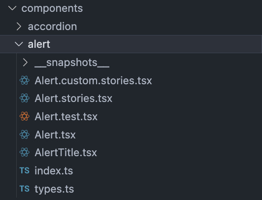

import { Aside } from 'astro-pure/user'

قبل از شروع، بر خود لازم می‌دانم به این نکته اشاره کنم که این مقاله ترجمه شده (همراه با بازنویسی و اقتباس) از مقاله‌ای دیگر است. بنابراین اگر خواندن مقاله تخصصی به زبان فارسی برای شما راحت نیست یا خواندن مقاله تخصصی به زبان انگلیسی برایتان جذاب‌تر است، می‌توانید به [منبع اصلی](https://thetshaped.dev/p/10-ways-organize-and-design-react-application?utm_campaign=post&utm_medium=web) این مقاله مراجعه کنید.

<hr class="hr-dotted" />

## مقدمه
زمانی که تصمیم دارید یک برنامه ری‌اکتی را توسعه دهید، نحوه سازماندهی و تنظیمات پروژه از اهمیت قابل توجهی برخوردار است؛ به‌طوری‌که می‌تواند به ما و تیم‌مان کمک کند تا به راحتی موارد مورد نیاز را پیدا کنیم، توسعه و بروزرسانی‌ها را سریع‌تر انجام دهیم یا حتی همه چیز را بدتر کند (با توجه به اینکه تنظیمات و سازماندهی اصولی یا غیر اصولی انجام شده است).

این اصل دقیقاً در ساختمان‌سازی هم وجود دارد. اگر پایه‌ها و ستون‌ها به درستی گذاشته و نیز موارد اصولی نیز به‌درستی رعایت شده باشند، آن ساختمان می‌تواند مدت طولانی‌تری دوام و استقامت داشته باشد، در غیر این صورت ممکن است ساختمان فرو ریزد و همه چیز از بین برود.

این 10 نکته را می‌توانید مانند اصول ساخت یک بنای مستحکم در نظر بگیرید. هرچه این بنا قوی‌تر باشد، دوام و کارآمدی آن در طول زمان بیشتر خواهد بود.

<Aside type='tip' title='ضرب‌المثل'>
خشت اول گر نهد معمار کج، تا ثریا می‌رود دیوار کج.
</Aside>

<hr class="hr-dotted" />

## 1. گروه‌بندی کامپوننت‌ها بر اساس مسئولیت‌ آن‌ها
سازماندهی فایل‌ها و فولدرها در یک برنامه React برای حفظِ نگه‌داری و قابلیت مدیریت آن بسیار مهم و حیاتی است. هر چقدر ساختار پروژه منطقی‌تر باشد، پیمایش و جابجایی در پروژه آسان‌تر و کمتر خواهد شد، درنتیجه زمان کمتری برای توسعه‌دهندگان صرفِ جستجو و تعجبْ از این‌که کجا و چگونه باید تغییرات را اعمال کنند، صرف خواهد شد.

مهم است که فایل‌ها نه تنها بر اساس نقش‌های فنی؛ بلکه بر اساس مسئولیت‌های دامنه آن‌ها نیز ساختاربندی شده باشند.

<Aside type='tip'>
منظور از "نقش فنی" این است که فایل‌ها را بر پایه‌ی نقش تکنیکی‌شان در پروژه گروه‌بندی کنیم. مثلا فولدرهایی مثل components که دربرگیرنده تمام کامپوننت‌ها و گروه‌بندی‌آن‌ها می‌باشد و یا services که دربرگیرنده تمام APIها باشد و ….

در مقابل، وقتی می‌گوییم "سازماندهی بر اساس مسئولیت دامنه‌ای (Domain Responsibility)" یا "مسیر صفحات (Route)"، منظور این است که فایل‌های مرتبط **با یک بخش** یا **ماژول** از پروژه را در کنار همان بخش یا ماژول قرار دهیم. این «بخش» می‌تواند یک صفحه‌ی خاص، یک فیچر (feature)، یا حتی یک ماژول (Module) باشد.
</Aside>

<br />

⛔ **اشتباه رایج**:‌ از گروه‌بندی کامپوننت‌ها صرفاً بر اساس مسئولیت‌های فنی اجتناب کنید

```md
/src
│   ...
│
└─ components
│    ├─ Header.js
│    ├─ Footer.js
│    ├─ InvoiceCard.js
│    └─ ProfileCard.js
│    │  ...
└─ containers
│    ├─ InvoicesContainer.js
│    ├─ PaymentProfilesContainer.js
│    │  ...
└─ presenters
│    ├─ InvoicesPresenter.js
│    ├─ PaymentProfilesPresenter.js
│    │  ...
│   ...
```

<br />

✅ **روش پیشنهادی**: بهتر است که کامپوننت‌ها را بر اساس مسئولیت‌های دامنه‌ای مانند مسیر صفحات (routes) یا ماژول‌ها (modules) گروه‌بندی شده باشند.

```md
/src
│   ...
│
├─ pages
│    ├─ billing
│    │    ├─ invoices
│    │    │    ├─ InvoiceCard.js
│    │    │    ├─ InvoicesContainer.js
│    │    │    ├─ useInvoices.js
│    │    │    ├─ InvoicesPage.js
│    │    │    └─ index.js
│    │    └─ payment-profiles
│    │         ├─ ProfileCard.js
│    │         ├─ ProfileContainer.js
│    │         ├─ usePaymentProfiles.js
│    │         ├─ PaymentProfilesPage.js
│    │         └─ index.js
│    │
│    └─ login
|        ├─ ...
|        └─ index.js
│
├─ common
│    └─ ...
└─ ...
```

<hr class="hr-dotted" />

## 2. قرار دادن کامپوننت‌ها در فولدر جداگانه

وقتی یک کامپوننت ساده است، شاید همه‌چیز در یک فایل جواب بدهد. اما اگر کامپوننتی دارای پیچیدگی‌های خاص است و چندین فایل مرتبط دارد (مانند استایل‌ها، تست، SubComponent)، بهتر است یک فولدر جداگانه سازمان‌دهی شود.

⛔ **اشتباه رایج**:‌ قرار دادن هر کامپوننت در یک فایل مجزا، بدون فولدر.

```md
/src
│
└─ components
│    ├─ Accordion.ts
|    ├─ Alert.ts
│    └─ ...
│
└─ ...
```

<br />

✅ **روش پیشنهادی**: برای هر کامپوننت یک دایرکتوری جداگانه بسازید تا همه‌ی فایل‌های مرتبط با آن، در همان دایرکتوری قرار بگیرند.

```md
/src
│
└─ components
    ├─ accordion
    |   ├─ index.ts
    |   └─ ...
    └─ alert
        ├─ Alert.tsx
        ├─ AlertTitle.tsx
        ├─ Alert.stories.tsx
        ├─ Alert.test.tsx
        ├─ types.ts
        └─ index.ts
```



<hr class="hr-dotted" />

## 3. استفاده از مسیردهی مطلق (Absolute Paths)

استفاده از نوع مناسب مسیردهی در پروژه می‌تواند پیمایش و نگهداری کد را آسان‌تر کند، به‌ویژه هنگامی که پروژه گسترش پیدا می‌کند. همچنین ری‌فکتور (refactor) پروژه را بسیار راحت‌تر خواهد کرد. با مسیردهی مطلق، دیگر لازم نیست مدام از `../../../utils` استفاده کنید، بلکه خیلی راحت می‌توانید ماژول‌ها را از هر جای پروژه فراخوانی کنید.

⛔ **اشتباه رایج**:‌ استفاده از مسیردهی نسبی (Relative Paths) در پروژه‌های بزرگ، مدیریت را دشوار و همواره مستعد خطا هستند، خودداری کنید.

```ts
import { formatDate } from '../../../utils';
```

<br />

✅ **روش پیشنهادی**: از مسیرهای مطلق (Absolute Paths) که خوانایی کد را بهبود می‌بخشند و بازنگری (refactor) کد را آسان‌تر می‌کنند، استفاده کنید.

```ts
import { formatDate } from '@common/utils';
```

<hr class="hr-dotted" />

## 4.استفاده از ماژول‌های مشترک (Common Modules)

ماژول‌های مشترک (Common module) نقش بسیار مهم و حیاتی در جلوگیری از تکرار کد و افزایش قابلیت استفاده مجدد از کد را در سراسر برنامه، ایفا می‌کنند. می‌توانید متدهای کمکی (utility method)، ثابت‌ها (constants)، کامپوننت‌ها، محاسبات (calculations) و غیره را در این ماژول مشترک نگهداری کنید.
این متمرکز سازی به مدیریت بهتر کد و استفاده مجدد از آن کمک می‌کند.

⛔ **اشتباه رایج**:‌ از پراکنده کردن ابزارها و کامپوننت‌های مشترک در مکان‌های مختلف پروژه خودداری کنید.

✅ **روش پیشنهادی**: ترجیحاً یک ماژول مشترک اختصاصی برای تمام کامپوننت‌ها و ابزارهای عمومی که در صفحات یا ماژول‌های مختلف استفاده می‌شوند، داشته باشید.

```md
/src
│   ...
│
└─ common
│    └─ components
│    │    └─ dialogs
│    │    │   └─ index.js
│    │    └─ forms
│    │    │   └─ index.js
│    │    └─ ...
│    └─ hooks
│    │    ├─ useDialog.js
│    │    ├─ useForm.js
│    │    └─ ...
│    └─ utils
│    │    └─ ...
└─ pages
│    └─ billing
│    │    └─ invoices
│    │        ├─ index.js
│    │        └─ ...
│    └─ ...
└─ ...
```

<Aside type='caution' title='دیدگاه مخالف مترجم'>
به دو علت استفاده از این ساختاربندی در پروژه‌های فرانت مخالفم:

1.  فولدرهایی که در سطح root یا src پروژه قراردارند، (جزء در موارد خاص مانند pages یا features) به طور معمول بیانگر موارد مشترک در کل پروژه هستند و نیازی به جداسازی این موارد در زیر دایرکتوری‌ای تحت عنوان common یا shared نمی‌باشد (مگر اینکه علت استفاده از این ساختار دلیل قانع‌کننده‌ی دیگری داشته باشد).
2.  این ساختار باعث ایجاد پیمایش‌های تودرتو می‌شود که نگهداری و دسترسی‌پذیری کد را کاهش می‌دهد.

_**توجه داشته باشید که**_ با استفاده از فولدر common یا shared در سطح root یا src پروژه مخالف هستم، اما ممکن هست که هر دایرکتوری (غالباً در فولدر features) بنا به نیاز خود دارای یک زیر دایرکتوری common یا shared نیز باشد.
</Aside>

<hr class="hr-dotted" />

## 5. ایجاد لایه‌ی انتزاع (Abstraction) برای کتابخانه‌ها و ماژول‌های خارجی
یکپارچه‌سازی و ادغام کتابخانه‌ها یا ماژول‌های خارجی نیازمند بررسی دقیق است تا از انعطاف‌پذیری در آینده و نگهداری آسان‌ترِ کد، اطمینان حاصل شود. استفاده مستقیم از کتابخانه‌ها یا کامپوننت‌های 3rd party در پروژه می‌تواند منجر به ایجاد مشکلاتی گردد؛ چراکه در صورت تغییر یا جایگزین‌شدن کتابخانه‌ی فعلی، بخش‌های متعددی از پروژه نیازمند تغییر و ری‌فکتور خواهند شد.

برای پیشگیری از این مشکل، بهتر است با ایجاد لایه‌های واسط (Wrapper) کتابخانه یا ماژول 3rd party را در یک تابع یا کامپوننت سفارشی دیگر کپسوله کنیم. این اقدام به ما این امکان را خواهد داد که یکپارچگی را در پروژه خود حفظ کرده و در صورت نیاز به تغییر و یا جایگزینی، از یک مبدا مشخص و واسط اقدام لازم را انجام دهیم.

⛔ **اشتباه رایج**:‌ از استفاده مستقیم از کامپوننت‌ها یا کتابخانه‌های 3rd party در پروژه خود خودداری کنید.

```tsx
// XYZ_Component.ts (file 1)
import { Button } from 'react-bootstrap';

// ABC_Component.ts (file 2)
import { Button } from 'react-bootstrap';
```

<br />

✅ **روش پیشنهادی**: بهتر است با ایجاد لایه واسط، کتابخانه‌ و یا کامپوننت‌ 3rd party را در یک تابع یا کامپوننت سفارشی دیگر محصور و کپسوله کنید.

```tsx
// XYZ_Component.ts (file 1)
import { Button } from '@components/ui';

// ABC_Component.ts (file 2)
import { Button } from '@components/ui';
```

<hr class="hr-dotted" />

## 6. مدیریت وابستگی‌ها در سطح ماژول‌ها و صفحات

مدیریت هوشمندانه وابستگی‌ها با متمرکزسازی منابع مشترک در یک ماژول مشترک (shared common)، می‌تواند به‌طور قابل‌توجهی قابلیت نگهداری و استفاده مجدد از کد را افزایش دهد.

اگر قطعه‌کدی در بیش از یک صفحه یا ماژول مورد استفاده قرار می‌گیرد، بهتر است آن را به یک ماژول مشترک انتقال داد تا از تکرار کد جلوگیری و نگه‌داری آن نیز ساده‌تر شود. این کار ضمن بهبود خوانایی کد، موجب شفافیت در وابستگی‌ها (Dependencies) نیز می‌شود.

<hr class="hr-dotted" />

## 7. نگه داشتن اجزا در نزدیکی جایی که استفاده می‌شوند (اصل هم‌جواری رفتار یا LoB)

> هرچه برای توسعه‌دهنده پیدا کردن یک قطعه کد آسان‌تر و سریع‌تر باشد، بهتر است.

اصل هم‌جواری رفتار (Locality of Behavior - LoB) بر این موضوع تأکید دارد که فایل‌ها و کامپوننت‌ها در نزدیکی محلی که از آن‌ها استفاده می‌شود، قرار گیرند. هدف این اصل آن است که توسعه‌دهنده در زمان اعمال تغییرات، مجبور نباشد در میان فولدرهای متعدد به جست‌وجوی فایل مورد نظر بپردازد. همچنین این اصل، سازماندهی کد به شکل ماژولار (modular) را ترویج می‌کند که در آن هر بخش از ماژول خودکفا (Self-contained) است.

این رویکرد خوانایی و نگهداری‌پذیری کد را بهبود می‌بخشد. زمانی که توسعه‌دهندگان روی یک ویژگی (feature) کار می‌کنند، تمام کدهای مرتبط در نزدیکی یکدیگر قرار دارند که فهم و تغییر آن‌ها را آسان‌تر می‌کند. همچنین بار شناختی ردیابی از طریق فایل‌ها و ماژول‌های دور (خارج از دید در یک نگاه) را کاهش می‌دهد.

به‌عنوان نمونه، اگر یک کامپوننت تنها در ماژول «Invoices» استفاده می‌شود، بهتر است همان‌جا در فولدر invoices نگه‌داری شود و در بخش‌های دیگر پروژه پخش نباشد. این رویکرد، فرآیند توسعه و نگه‌داری را به‌مراتب ساده‌تر می‌کند.

به‌عنوان مثال، اگر یک کامپوننت یا هوک تنها در ماژول «Invoices» استفاده می‌شود، بهتر است همان‌جا در فولدر invoices نگه‌داری شود و در بخش‌های دیگر پروژه قرار نگیرد.

```md
/src
│   ...
│
└─ common
│    └─ components
│    │    └─ ...
│    └─ hooks
│    │    └─ ...
│    └─ utils
│    │    └─ ...
└─ pages
│    └─ billing
│    │    └─ invoices
│    │    │   │   index.js
│    │    │   └─ ...
│    │    └─ payment-profiles
│    │    │   │   index.js
│    │    │   └─ ...
│    │    └─ hooks
│    │    │   │   index.js
│    │    │   │   useInvoices.js
│    │    │   │   usePaymentProfiles.js
│    │    │   └─ ...
│    │    └─ utils
│    │    │   │   index.js
│    │    │   │   formatAmount.js
│    │    │   └─ ...
└─ ...
```

<hr class="hr-dotted" />

## 8. دقت در استفاده از توابع کمکی (Utility Functions)

توابع کمکی (Utility) عموماً عملکردهای ساده و قابل استفاده‌ی مجددی مانند فرمت تاریخ، اعتبارسنجی و تبدیل داده را پوشش می‌دهند و به منطق پیچیده یا قوانین خاص کسب‌وکار وابسته نیستند.

توابع کمکی باید خالص (pure) و هدف‌مند باقی بمانند و بر وظایف عمومی مانند فرمت تاریخ‌ها، تبدیل انواع داده‌ها و غیره تمرکز کنند. ترکیب آن‌ها با منطق کسب‌وکار (business logic) مانند نحوه پردازش داده‌ها یا تصمیم‌گیری‌های خاص کسب‌وکار، می‌تواند این توابع را بیش از حد پیچیده و کمتر قابل استفاده مجدد کند.

همچنین، منطق تجاری و قوانین کسب‌وکار معمولاً بیشتر از توابع کمکی تغییر می‌کنند، بنابراین با جدا کردن آن‌ها، نگهداری کلی کد بهبود می‌یابد.

⛔ **اشتباه رایج**:‌ از افزودن منطق کسب‌وکار به توابع کمکی (Utility function) خودداری کنید.

✅ **روش پیشنهادی**: جدا نگه‌داشتن منطق کسب‌وکار از توابع کمکی و نگه داشتن توابع کمکی به صورت خالص و عمومی.

<hr class="hr-dotted" />

## 9. استفاده هوشمندانه از منطق کسب‌وکار (Business Logic)

قرار دادن منطق کسب‌وکار (Business Logic) درون کامپوننت‌های رابط کاربری (UI) می‌تواند کامپوننت‌ها را بیش از اندازه پیچیده و حجیم کند و فرآیند تست و نگه‌داری را دشوار سازد.

در React، هوک‌های سفارشی (Custom Hooks) ابزار بسیار خوبی برای انتزاع و جداسازی منطق کسب‌وکار از کامپوننت‌ها هستند. با استفاده از هوک‌ها، می‌توانید منطق کسب‌وکار را در یک مکان جداگانه کپسوله کنید و رابط کاربری خود را تمیز و متمرکز بر رندرینگ نگه دارید.

این جداسازی نه تنها کامپوننت‌های ما را ماژولارتر (modular) و مدیریت آن‌ها را آسان‌تر می‌کند، بلکه قابلیت استفاده مجدد و نگهداری را نیز افزایش می‌دهد.

⛔ **اشتباه رایج**:‌ از ترکیب منطق کسب‌وکار با رابط کاربری خودداری کنید.

✅ **روش پیشنهادی**: با استفاده از هوک‌های سفارشی (Custom Hooks)، منطق کسب‌وکار را از رابط کاربری جدا نگه دارید.

<hr class="hr-dotted" />

## 10. ثابت نگه داشتن وابستگی‌ها

در مدیریت پروژه‌های جاوااسکریپت، فایل package.json نقش حیاتی و مهمی را ایفا می‌کند. این فایل وابستگی‌های پروژه را تعریف می‌کند؛ یعنی پکیج‌های خارجی‌ای که پروژه برای عملکرد صحیح خود به آن‌ها نیاز دارد را مشخص می‌کند. 

در فایل package.json، بهتر است نسخه‌های دقیق کتابخانه‌های مورد استفاده را مشخص کنید تا همه‌ی اعضای تیم، بدون هیچ تناقضی در نسخه‌ها، از همان نسخه‌های معین شده استفاده کنند. به‌کارگیری بازه‌های نسخه (مثل ^ و ~ و * یا latest) ممکن است منجر به نصب نسخه‌های بالاتر و ناهماهنگ شود و از بروز مشکلات غیرمنتظره‌ که ممکن است به دلیل به‌روزرسانی‌های جزئی (minor update) یا پچ‌ها (patch) رخ می‌دهد، جلوگیری کند.

⛔ **اشتباه رایج**:‌ از استفاده از بازه‌های نسخه (version ranges) در فایل package.json خودداری کنید.

```json
// [!code word:^]
// [!code word:>=]
{
  "dependencies": {
    "express": "^4.17.1",
    "react": ">=16.8.0"
  }
}
```

<br />

✅ **روش پیشنهادی**: از نسخه‌های دقیق و مشخص در فایل package.json استفاده کنید.

```json
{
  "dependencies": {
    "express": "4.17.1",
    "react": "16.8.0"
  }
}
```

<hr class="hr-dotted" />
منبع:
*   [10 ways to better organize and design your React Application](https://thetshaped.dev/p/10-ways-organize-and-design-react-application?utm_campaign=post&utm_medium=web)
