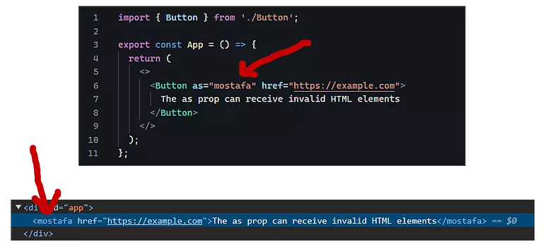
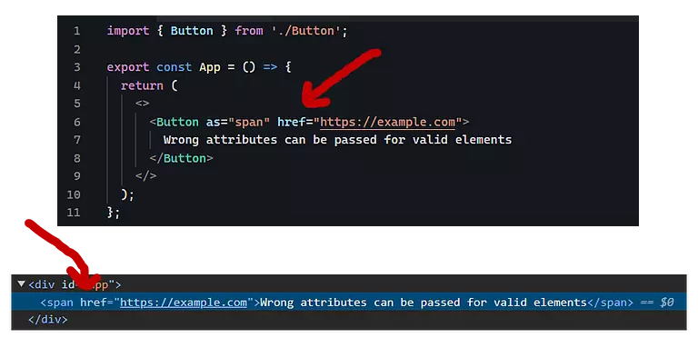
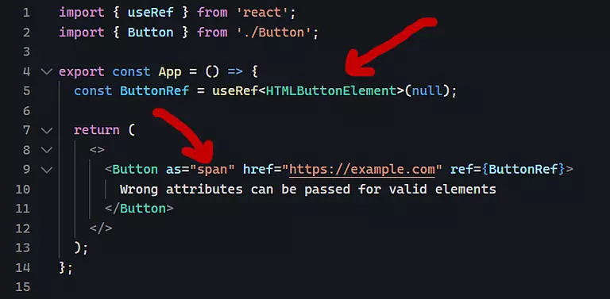
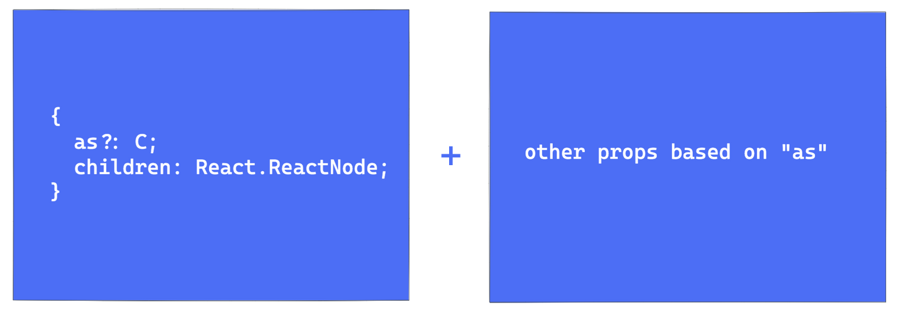

import { Aside } from 'astro-pure/user'

خوب تو [قسمت قبل](/blog/polymorphic-component-in-react-part1/) یکسری ملزوماتی رو برای پیاده‌سازی یک Polymorphic Component گفتیم، توی این قسمت قراره بیشتر دست به کد بشیم.

## نوشتن یک کامپوننت Polymorphic ساده

همونطور که در بخش اول گفتیم اگه بخواییم یک کامپوننت Polymorphic رو بدون Type Safety ایجاد کنیم، مشکل خاصی نداریم، پس از همین بخش شروع می‌کنیم و کم‌کم کامپوننت رو توسعه می‌دیم تا به چیزی که مدنظرمون هست تبدیل بشه.

ساده‌ترین روش ایجاد یک کامپوننت Polymorphic به صورت زیر هست:


```jsx title="simple-polymorphic-components-react.jsx"
import * as React from 'react';

const Button = ({as, children, ...otherProps}) => {
  /*
   * نمی‌توانیم به عنوان یک کامپوننت به صورت زیر استفاده کنیم as توجه داشته باشید که ما از پراپس
   * <as> ... </as>
   * به این دلیل که در ری‌اکت حتما نیاز هست که نام کامپوننت با حرف بزرگ شروع شود
   * @see https://t.ly/peF5w
  */

  const Component = as || 'button';

  return <Component {...otherProps}>{children}</Component>
}
```

با استفاده از کد بالا، ما به همین راحتی سه مورد اول از ملزومات پیاده‌سازی یک Polymorphic Component در ری‌اکت رو ایجاد کردیم.

<hr class="hr-dotted" />

اگر یک توضیح مختصری بخوام در خصوص موارد گفته شده بگم، همونطور که مشاهده می‌کنید:

1.  کامپوننت ما یک پراپس به عنوان as دریافت می‌کند (مورد اول از ملزومات)
2.  این پراپرتی تعیین می‌کند که المنتی در DOM باید رندر شود چه چیزی می‌باشد (مورد دوم از ملزومات)
3.  همچنین با استفاده از [Rest parameters](https://developer.mozilla.org/en-US/docs/Web/JavaScript/Reference/Functions/rest_parameters)، کامپوننت ما از سایر اتریبیوت‌ها و ویژگی‌ها پیشتبانی می‌کند. (مورد سوم از ملزومات)


```jsx
import { Button } from './components/Button';

const App = () => {
  return (
    <>
      <Button as="a" href="https://example.com">
        Link Button
      </Button>
      <br />
      <Button as="span">Span Button</Button>
      <br />
      <Button>Real Button</Button>
    </>
  );
};

export default App;
```

احتمالا با مواردی که در بخش قبل گفته شد، می‌تونید حدس بزنید که کامپوننت بالا چه مشکلاتی داره. قبل از برطرف کردن این مشکلات، بهتره اون‌ها رو به صورت شفاف بشناسیم:

<hr class="hr-dotted" />

## معایب کامپوننت Polymorphic بدون رعایت Type Safety

1.  پراپرتی as هر چیزی رو به عنوان ورودی قبول می‌کند، حتی یک HTML المنت غیرمعتبر (تگ mostafa یک HTML المنت غیرمعتبر می‌باشد)



2.  حتی اگر مقدار as یک HTML المنت معتبر باشد، ممکن است اتریبیوت‌های اشتباه وارد شود (اتریبیوت href متعلق به تگ span نمی‌باشد)



3.  سومین مشکل هم در خصوص forwardRef هست. اگر کامپوننت ما از این ویژگی پشتیبانی کند، می‌تواند مقدار ref دریافت شده از کامپوننت، خارج از مقدار تعیین شده در تایپ‌اسکریپت باشد. در مثال زیر مقدار ref را یک HTMLButtonElement تعیین کرده‌ایم اما پراپرتی as برابر با تگ span می‌باشد!



<hr class="hr-dotted" />

## رفع مشکلات گفته شده و Type Safety کردن کامپوننت

برای رفع مشکل ابتدا ما باید به دنبال راه‌حلی باشیم که بتوانیم نوع/تایپ کامپوننت را بر اساس مقدار ورودی اون (همون پراپس as) تعیین کنیم که فقط مقادیری را به عنوان ورودی بپذیرد که یا جزء HTML المنت‌ها معتبر باشند و یا یک کامپوننت ری‌اکتی باشد.

اینجاست که Generic‌ها در تایپ‌اسکریپت به کمک ما می‌یان.

> با Generic ها می‌تونیم کامپوننت (تابع، کلاس‌ و ...)هایی بنویسیم که با نوع‌های داده‌ای مختلفی کار کنن. بجای اینکه کامپوننت‌مون وابسته به یک نوع داده خاص مثلا عددی یا رشته‌ای باشه. ([منبع](https://ditty.ir/posts/typescript-101-generics/nBE45))

برای اینکه بتونیم نوع یک المنت رو در ری‌اکت مشخص کنیم باید به سراغ یک Utility Type در ری‌اکت به نام `React.ElementType` بریم که خودش یک جنریک تایپ هست.

```tsx
// [!code word:<C extends React.ElementType>]
import * as React from 'react';

/**
 * یک جنریک تایپ است که بیانگر React.ElementType تایپ
 *  1. می‌باشد HTML تمامی تگ‌های ولید و معتبر
 *  2. می‌تواند یک کامپوننت ری‌اکتی باشد
 */
type ButtonProps<C extends React.ElementType> = {
  as?: C;
  children: React.ReactNode;
};

export const Button = <C extends React.ElementType>({
  as,
  children,
  ...otherProps
}: ButtonProps<C>) => {

  /**
   * as در صورت عدم تعیین پراپرتی DOM مقدار پیش‌فرض المنت رندرشده در
  */
  const Component = as || 'button';

  return <Component {...otherProps}>{children}</Component>;
};
```

<Aside type='note'>
همانطور که در کد بالا در _**خط 8**_ مشاهده می‌کنید، برای تعیین نوع جنریک تایپ (یعنی `C`) از کلید واژه `extends` استفاده کرده‌ایم که این بدین معناست که `C` باید یک نوع (type) معتبر برای `React.ElementType` باشد. که خودش یک Utility Type برای ری‌اکت است که بیانگر:

1.   تمامی تگ‌های ولید و معتبر HTML است
2.  و یا می‌تواند یک کامپوننت دیگر از ری‌اکت باشد

در _**خط 22**_ نیز مقدار پیش‌فرض المنت رندرشده در DOM را برابر با `button` قرارداده‌ایم.
</Aside>

با انجام این کار، مشکل اول برطرف می‌شه و کامپوننت Polymorphic ما فقط مقادیر مجاز رو قبول می‌کنه.

<hr class="hr-dotted" />

بریم سراغ رفع مشکل دوم، همونطور که در بخش قبلی گفتیم کامپوننت Polymorphic ما باید دارای این ویژگی باشد:

> کامپوننت باید موارد زیر نیز پشتیبانی کند: (مورد سوم از ملزومات)
>
> *   اتریبیوت‌های سراسری/گلوبال مانند id یا class و ...
> *   از اتریبیوت‌های مختص با المنت تعیین شده، مانند src در تگ img یا href در تگ a و ...
> *   پراپس‌های کاستوم/سفارشی در کامپوننت‌های دیگر یا Third Party؛ مثلا کامپوننت Link در فریم‌ورک NextJs پراپس‌هایی مانند replace یا prefetch و ... را دارد.


دقیقا مشکل همینجاست که کامپوننت ما از هیچ اتریبیوتی (چه گلوبال و ...) به صورت Type Safety پشتیبانی نمی‌کنه. مثلا اگر مقدار پراپرس `as` را برابر با تگ a قرار دهید، طبیعتاً نیاز به اتریبیوت‌های مختص این تگ مانند `href`, `target` و ... داریم.

```ts
{
    as?: C;
    children: React.ReactNode;
} & {
    // یک چیزی شبیه به این؟
    ...otherValidPropsBasedOnTheValueOfAs  // [!code highlight]
}
```
<br />



<br />

برای اینکه این مورد رو برطرف کنیم نیاز هست به سراغ یک Utility Type دیگر از ری‌اکت بریم که عبارتند از:

*   React.ComponentProps
*   React.ComponentPropsWithRef
*   React.ComponentPropsWithoutRef

برای این متوجه بشیم این تایپ‌ها چی هستن و کاربردشون چی هست من از Chat GPT برای پاسخ به این سوال کمک گرفتم، که در ادامه پاسخ Chat GPT رو می‌خونید:

> در لایبری ReactJS (ری اکت جی اس)، این سه تایپ مربوط به خصوصیت‌ها و پارامترهای ورودی کامپوننت‌ها هستند. البته به صورت استاندارد و در حالت عمومی، معمولاً از نوع طراحی «تایپ اعمال کننده‌ی پارامتر» برای نام‌گذاری این تایپ‌ها استفاده می‌شود.
>
> **React.ComponentProps:**<br />
> این نوع تایپ برای نام‌گذاری و استفاده از پارامترهای ورودی کامپوننت‌ها استفاده می‌شود. به عبارتی، نوع این تایپ برابر است با نوع خصوصیت‌های پیش‌فرض کامپوننت. در واقع مجموعه‌ای از تمام پارامترهای ورودی کامپوننت را نمایش می‌دهد. این شامل پارامترهای خاصی می‌شود که در کد مورد استفاده مشخص شده است و پارامترهایی که برای کاربرد عمومی هستند (مانند کلاس‌های CSS، رویدادها، و غیره).
>
> **React.ComponentPropsWithRef:**<br />
> این نوع تایپ نسخه‌ای از `React.ComponentProps` است که جهت استفاده در کامپوننت‌هایی که قابل استفاده از `ref` هستند، طراحی شده است. Refs در React به شما اجازه می‌دهند تا به طور مستقیم به عنصر DOM یا کامپوننت‌هایی که به آن تعلق دارند، دسترسی داشته باشید. `React.ComponentPropsWithRef` شامل پارامترهای ورودی عمومی کامپوننت است و همچنین یک پارامتر ref برای استفاده از ref به صورت ضروری دارد.
>
> **React.ComponentPropsWithoutRef:** <br />
> این نوع تایپ همچنین نسخه‌ای از `React.ComponentProps` است، اما برخلاف `React.ComponentPropsWithRef`، پارامتر `ref` در آن حذف شده است. این برای استفاده در کامپوننت‌هایی مناسب است که نیازی به دسترسی مستقیم به `ref` ندارند و این پارامتر برای آن‌ها مورد نیاز نیست.

چون در این بخش قصد این رو نداریم که به موضوع Ref بپردازیم، پس به سراغ `React.ComponentPropsWithoutRef` می‌ریم و کد قبلی‌مون رو به صورت زیر اصلاح می‌کنیم:

```tsx
// [!code word:React.ComponentPropsWithoutRef<C>]
import * as React from 'react';

type ButtonProps<C extends React.ElementType> = {
  as?: C;
  children: React.ReactNode;
} & React.ComponentPropsWithoutRef<C>; // 👈 look here

export const Button = <C extends React.ElementType>({
  as,
  children,
  ...otherProps
}: ButtonProps<C>) => {
  const Component = as || 'button';

  return <Component {...otherProps}>{children}</Component>;
};
```

الان با استفاده از این Utility Type، ما تنوستیم بخشی از مشکل دوم رو هم برطرف کنیم. به عبارت دیگر کامپوننت Polymorphic ما در حال حاظر از اتریبیوت‌های گلوبال، سفارشی و ... نیز به صورت Type Safety پشتیبانی می‌کند.

<hr class="hr-dotted" />

فکر کنم تنوسته باشید حدس بزنید که با انجام کد مطابق با موارد بالا، همچنان دو مشکل دیگر باقی‌ مانده که نیازه برطرف بشه:

1.  در کد بالا، در خط 13 گفتیم که اگر مقدار as پاس داده نشده باشد، مقدار پیش‌فرض آن برابر با button در نظر گرفته شود (از نظر جاوا اسکریپت)، اما مشکلی که وجود دارد این هست که در این صورت اتریبیوت‌های مرتبط با تگ button مانند type، disabled و ... پشتیبانی نمی‌شود. چون جنریک تایپ ما در انتظار انتخاب یک نوع تگ هست و هیچ تگی هم انتخاب نشده است. (از نظر تایپ‌اسکریپت)

```tsx
<Button>click here</Button>
```

جهت برطرف کردن این مورد ما باید در زمان تعریف کامپوننت مقدار پیش‌فرض جنریک تایپ را هم تعیین کنیم، یعنی آن را برابر با `button` قرار دهیم:

```tsx
// [!code word:'button':9]
import * as React from 'react';

type ButtonProps<C extends React.ElementType> = {
  as?: C;
  children: React.ReactNode;
} & React.ComponentPropsWithoutRef<C>;

//                                                     👇 look here
export const Button = <C extends React.ElementType = 'button'>({
  as,
  children,
  ...otherProps
}: ButtonProps<C>) => {
  const Component = as || 'button';

  return <Component {...otherProps}>{children}</Component>;
};
```

<hr class="hr-dotted" />

مورد بعدی اینکه فرض کنید که Polymorphic کامپوننت ما پراپس‌های دیگری مانند `color` یا `font` و ... داشته باشد که این پراپرتی‌ها نیز در مقدار پاس داده شده به عنوان `as` نیز وجود داشته باشد. (یعنی پراپس‌ها با هم تداخل یا همپوشانی داشته باشند) در این صورت برای برطرف کردن این مشکل باید چه کاری انجام دهیم؟

فکر کنم این مورد رو در قالب کد توضیح بدم، بهتر باشه.

فعلا این کد رو داشته باشید، چون در ادامه می خوام این کد رو اصلاح کنیم و به چند تایپ مستقل تبدیلش کنیم:

```tsx
// [!code word:color?\: Rainbow | "black"]
import * as React from 'react';

type Rainbow = "red" | "orange" | "yellow" | "green" | "blue" | "indigo" | "violet";

type ButtonProps<C extends React.ElementType> = {
  as?: C;
  color?: Rainbow | "black"; // 👈 look here
  children: React.ReactNode;
} & React.ComponentPropsWithoutRef<C>;

export const Button = <C extends React.ElementType = 'button'>({
  as,
  children,
  ...otherProps
}: ButtonProps<C>) => {
  const Component = as || 'button';

  return <Component {...otherProps}>{children}</Component>;
};
```

کد بالا رو به صورت زیر ریفکتور کردیم:

```tsx
import * as React from 'react';

type Rainbow = "red" | "orange" | "yellow" | "green" | "blue" | "indigo" | "violet";


/**
 * از تایپ پایین، این دو مورد حذف شدند:
 * children: React.ReactNode
 * React.ComponentPropsWithoutRef<C>
*/
type ButtonProps<C extends React.ElementType> = {
  as?: C;
  color?: Rainbow | "black";
};


/**
 * یک تایپ جدید ایجاد کردیم
 * در ری‌اکت می شه children یک جنریک تایپ هست که شامل پراپرتی React.PropsWithChildren تایپ
 * و پراپرتی‌های کامپوننت رو هم به عنوان ورودی به این جنریک تایپ پاس دادیم
 * ButtonProps<C> یعنی
 *
 * اضافه کردیم React.ComponentPropsWithoutRef<C> و سپس تایپ
 *
 * در نهایت هم از این تایپ، برای تعیین نوع پراپرتی‌های کامپوننت استفاده می‌کنیم
*/
type Props <C extends React.ElementType> = React.PropsWithChildren<ButtonProps<C>> & React.ComponentPropsWithoutRef<C>;


export const Button = <C extends React.ElementType = 'button'>({
  as,
  children,
  ...otherProps
}: Props<C>) => {
  const Component = as || 'button';

  return <Component {...otherProps}>{children}</Component>;
};
```

برای رفع عدم تداخل یا هم‌پوشانی پراپرتی های تعیین شده (کاستوم)‌ با پراپرتی های گلوبال یا Third Party کاری که باید انجام بدیم، این هست که از `Omit` و `Keyof` در تایپ اسکریپت کمک می‌گیریم، که در نهایت به کد زیر می‌رسیم:

```tsx
/**
 * قبل از تغییر // [!code highlight]
*/
type Props <C extends React.ElementType> = React.PropsWithChildren<ButtonProps<C>> & React.ComponentPropsWithoutRef<C>;

/**
 * بعد از تغییر // [!code highlight]
*/
type Props <C extends React.ElementType> =
React.PropsWithChildren<ButtonProps<C>> &
Omit<React.ComponentPropsWithoutRef<C>, keyof ButtonProps<C>>;

/**
 * `Keyof` و `Omit` کاری که انجام دادیم درواقع این بود که با استفاده از
 * پراپرتی‌هایی که با موارد تعیین شده توسط ما تداخل یا هم‌پوشانی دارند را حذف می‌کنیم
 * به صورت زیر:
 * Omit<React.ComponentPropsWithoutRef<C>, keyof ButtonProps<C>>;
*/
```

الان می‌تونیم در کامپوننتی که نوشتیم از پراپرتی تعریف شده `color` استفاده کنیم. در مثال زیر ورودی این پراپرتی رو در اتریبیوت `style` استفاده می‌کنیم.

```tsx
import * as React from 'react';

type Rainbow = "red" | "orange" | "yellow" | "green" | "blue" | "indigo" | "violet";

type ButtonProps<C extends React.ElementType> = {
  as?: C;
  color?: Rainbow | "black";
};

type Props <C extends React.ElementType> =
React.PropsWithChildren<ButtonProps<C>> &
Omit<React.ComponentPropsWithoutRef<C>, keyof ButtonProps<C>>;

export const Button = <C extends React.ElementType = 'button'>({
  as,
  children,
  color, // 👈 look here
  ...otherProps
}: Props<C>) => {
  const Component = as || 'button';

  // را با استایل‌های وارد شده در یک آبجکت ذخیره می‌کنیم color مقدار ورودی
  const styles = color ? { style: {...otherProps.style, color } } : {style: {...otherProps.style} };

  // در نهایت به کامپوننت پاس می‌دهیم
  return <Component {...otherProps} {...styles}>{children}</Component>;
};
```

<hr class="hr-dotted" />

الان ما یک کامپوننت چندریختی یا polymorphic داریم که تمام مواردی که گفتیم رو پشتیبانی می‌کنه. برای اینکه بتونیم از این تایپ در موارد گوناگون استفاده کنیم و نیاز نباشه به ازای هر کامپوننت یکبار تمام این مراجل رو پیش بریم، پیشنهاد می کنم که یک تایپ مجزا مثلا به نام `PolymorphicWithoutRef` در تایپ اسکریپت ایجاد کنید و حالا به ازای هر کامپوننت تنها نیاز هست که این تایپ رو بهش پاس بدید. (طبیعتا این تایپ هم باید جنریک باشد)

این بخش آخر رو می‌سپارم به خودتون.

<hr class="hr-dotted" />

فقط یک مورد دیگه باقی موند و اونم بحث ref در مورد کامپوننت ها هست و اینکه چطوری این مقدار رو در کامپوننت های polymorphic به صورت داینامیک مدیریت کنیم، که ان‌شاءالله این مورد رو در قسمت بعدی بهش می‌پردازیم.


امیدوارم تا اینجا مفید واقع شده باشد.

<hr class="hr-dotted" />

ضمنا منابعی که من برای نوشتن این مجموعه مقالات استفاده کردم فعلا موارد زیر هست:
*   [پلی مورفیسم در برنامه نویسی چیست؟ – مفهوم به زبان ساده + مثال](https://b.fdrs.ir/58j)
*   [Build strongly typed polymorphic components with React and TypeScript](https://blog.logrocket.com/build-strongly-typed-polymorphic-components-react-typescript/)
*   [React polymorphic components with TypeScript](https://isamatov.com/polymorphic-components-react-typescript/)
*   [React “Polymorphic Components” With TypeScript](https://betterprogramming.pub/react-polymorphic-components-with-typescript-real-practice-example-94c8a205d079)
*   [Polymorphic React components with TypeScript](https://jarocki.me/notes/polymorphic-react-components)
*   [Build Polymorphic Components with React and Typescript](https://www.udemy.com/course/build-polymorphic-components-with-react-and-typescript/?couponCode=NEWYEARCAREER)
